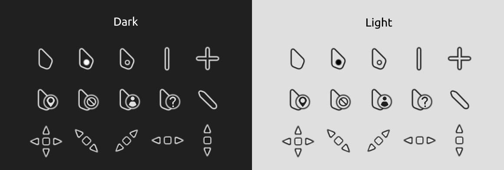

# GhostLine Cursor Theme

GhostLine is a minimalist and modern Windows cursor theme with soft edges, subtle animations, and clean lines.
Based on [Minimalistic V3](https://www.deviantart.com/skyeo84/art/Minimalistic-V3-cursor-909469275) by [SkyeO84](https://www.deviantart.com/skyeo84) \- expanded, edited, and refined for my personal taste.

## 📦 Installation

1. Download the latest version of GhostLine:

   \> Go to the [**Releases**](https://github.com/patinhooh/ghostline-cursor/releases) page

   \> Download the `.zip` under **Latest**

2. Extract the ZIP file anywhere on your PC

3. Open the extracted folder and **right-click** on `Install.inf`

4. Choose **Install**

5. In the ***Mouse Properties*** window:

   \> Go to the **Pointers** tab \> Choose **GhostLine** from the dropdown

6. Click **Apply**, then **OK**

## 📝 Credits

- **Original base**: [Minimalistic V3](https://www.deviantart.com/skyeo84/art/Minimalistic-V3-cursor-909469275) by [SkyeO84](https://www.deviantart.com/skyeo84)
- **Modified & expanded by**: [Patinhooh](https://github.com/patinhooh)
- Icons and layout refined using [RealWorld Cursor Editor](https://www.rw-designer.com/cursor-maker)
